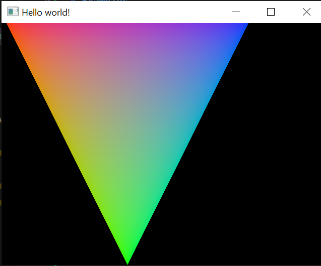
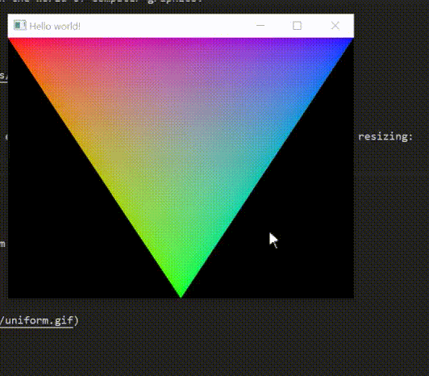
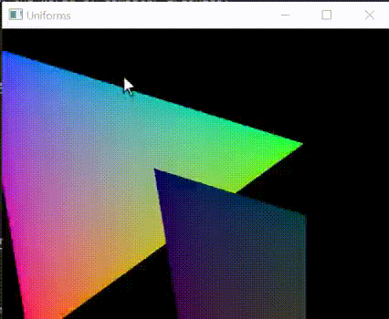
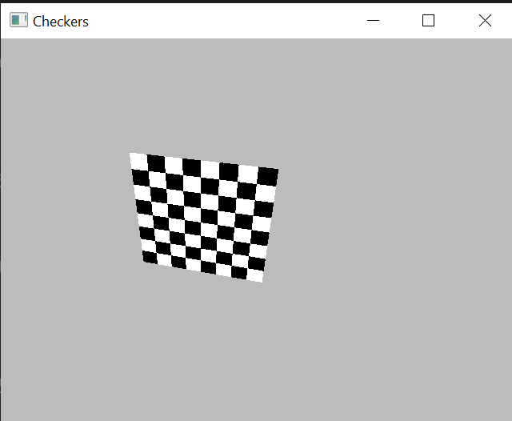
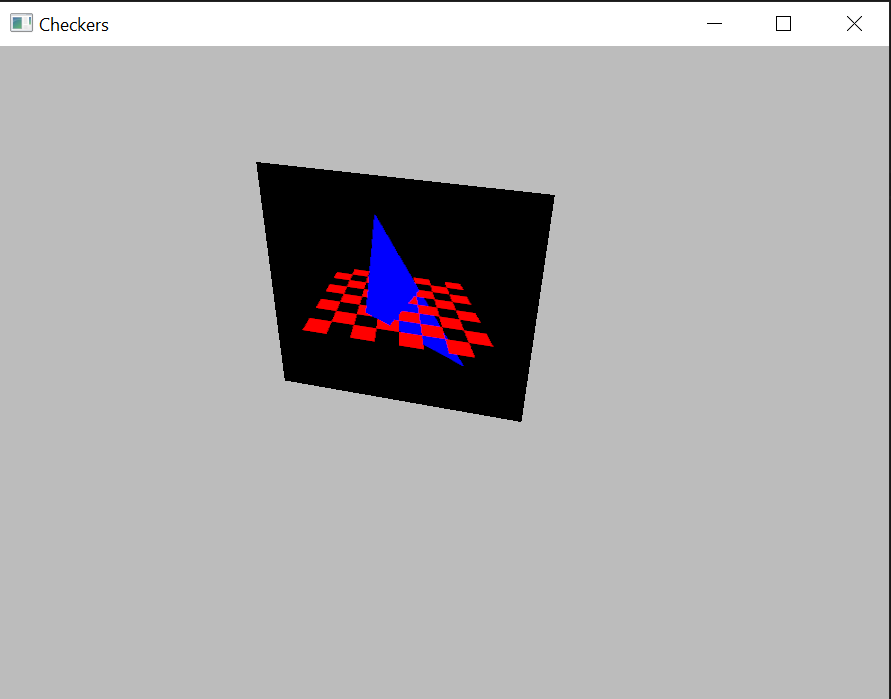
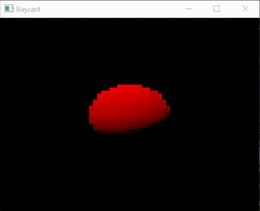

These are refined examples from [GPipe tutorial](https://github.com/tobbebex/GPipe-Core/) adapted to GHC 9.8.1. 

The tested setup on Windows:
- ghcup 0.1.22.0
- GHC 9.8.2
- cabal 3.10.3.0
- hls (optional) 2.7.0.0 

# Examples

## Triangle 

The simplest hello-world in the world of computer graphics:
```
cabal run gpipe-triangle
```



## Resize 

Showcase how to use shader environment to pass around window size to enable dynamic resizing:
```
cabal run gpipe-resize
```



## Uniform 

Showcase how to use uniform buffers to pass data inside shader:
```
cabal run gpipe-uniform
```



## Sampling 

Showcase how to make procedural textures and sample from them:
```
cabal run gpipe-sampling
```



## Offscreen 

Showcase how to render to texture and use it in the following render pass:
```
cabal run gpipe-offscreen
```



## Raycast 

My own example that demonstrates very basic raycasting technique. 
```
cabal run gpipe-raycasting
```


